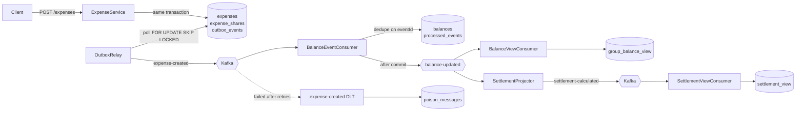

# Expense Settlement System

An event-driven backend for splitting shared expenses, in the style of Splitwise. Built with
Java 21, Spring Boot 3.5, Kafka and PostgreSQL.

The interesting parts are not the CRUD. They are: keeping a derived read model correct when
delivery is at-least-once, never losing an event to a dual write, and splitting money that
does not divide evenly.

---

## Architecture



Writes go through the command side and land in Postgres. Reads are served from projections
that Kafka consumers maintain. The two are eventually consistent, and the system is designed
around that rather than pretending otherwise.

---

## The three problems worth explaining

### 1. The dual write, and why the outbox exists

The obvious implementation saves the expense and then publishes to Kafka:

```java
expenseRepo.save(expense);
kafkaTemplate.send("expense-created", event);   // <-- different system, no shared transaction
```

This is broken in both directions. If the broker times out after the DB commits, the balance
update never happens and no one notices. If the DB rolls back after a successful send,
consumers process an expense that does not exist.

Instead the event is written as a row in `outbox_events` in the *same* transaction as the
expense. Either both are durable or neither is. `OutboxRelay` then polls and publishes:

```sql
SELECT * FROM outbox_events
WHERE published_at IS NULL
ORDER BY created_at
LIMIT :batchSize
FOR UPDATE SKIP LOCKED
```

`SKIP LOCKED` is what makes the relay horizontally scalable — concurrent instances claim
disjoint batches instead of blocking on each other's locks.

Delivery is still at-least-once: the broker can accept a record and the relay can die before
marking the row published. That is handled by the next section, not by pretending it cannot
happen.

### 2. Effectively-once, not exactly-once

Consumers deduplicate on `eventId` using a `processed_events` table. The dedup row and the
balance mutation commit in one transaction, so a redelivered record is a no-op.

This is **effectively-once processing**, not Kafka exactly-once semantics. Real EOS needs a
transactional producer and `read_committed` consumers so that offset commits and writes are
one atomic unit. This system deliberately does not do that: the dedup table gets the same
practical guarantee for balance arithmetic at a fraction of the operational cost.

Ordering is handled separately. Every topic is keyed by `groupId`, so all events for a group
land on one partition where offset order is total order. Without that key, an unkeyed
full-group snapshot could be applied after a newer one and the read model would move
backwards in time.

### 3. Money that does not divide evenly

Split 10.00 three ways. Round each part to 3.33 and a paisa vanishes; round each to 3.34 and
you invent one. Either way group balances stop summing to zero, and because balances are
cumulative the error compounds with every expense until settlements no longer clear.

`ShareAllocator` uses the largest-remainder method: work in integer minor units, give
everyone the floor, then distribute the leftover units one at a time.

```
10.00 / 3  ->  [3.34, 3.33, 3.33]   sums to exactly 10.00
```

No participant is ever off by more than one paisa, and the total is exact by construction
rather than by rounding luck. Amounts carrying sub-paisa precision are rejected rather than
silently rounded, because quietly turning a caller's 10.005 into 10.01 invents money.

---

## Settlement algorithm

Balances are stored as one net figure per user per group, not as a debt graph. That choice
means cycles (A owes B owes C owes A) cancel automatically instead of needing to be detected
and unwound.

Settlement is a greedy largest-creditor / largest-debtor match over two heaps.

**It is a heuristic, not an optimal minimiser.** Minimising the number of transfers is
NP-hard — any subset of users whose balances sum to zero can be settled internally, and
finding those subsets is subset-sum. What greedy does guarantee is an upper bound of `n-1`
transfers for `n` participants with non-zero balances, since every iteration drives at least
one participant to exactly zero. It runs in O(n log n) and always clears every debt.

Exact minimisation is exponential and not worth it at realistic group sizes. If it ever
became worth it, the approach would be subset-partitioning before the greedy pass.

---

## Failure modes

| Failure | Behaviour |
|---|---|
| Broker unreachable when an expense is created | Expense still commits; event stays in the outbox and publishes when the broker returns |
| Relay dies mid-publish | Row stays unpublished, next poll resends; consumer dedupe absorbs the duplicate |
| Consumer crashes after DB commit, before offset commit | Record is redelivered; `processed_events` makes it a no-op |
| Malformed event (shares do not sum to amount, missing id) | Non-retryable, routed straight to `expense-created.DLT` and persisted in `poison_messages` — the consumer group keeps moving |
| Transient consumer failure | 3 retries at 2s, then DLT |
| Entity/schema drift | Application refuses to start (`ddl-auto=validate`) |

---

## Running it

```bash
docker compose -f docker/docker-compose.yml up -d
./mvnw spring-boot:run
```

Flyway applies the schema on startup. Configuration falls back to the compose defaults, so
no setup is needed locally; override via `DB_URL`, `DB_USER`, `DB_PASSWORD` and
`KAFKA_BOOTSTRAP_SERVERS` anywhere else.

### API

```http
POST /expenses                      # create an expense (EQUAL or EXACT split)
GET  /expenses                      # list expenses
GET  /balances/{groupId}            # net balances, served from the projection
GET  /settlements/{groupId}         # settlement plan, served from the projection
GET  /groups/{groupId}/settlements  # settlement plan, computed live from the write model
GET  /actuator/health | /actuator/prometheus
```

Equal split — the server does the division, so rounding is handled server-side:

```json
{
  "groupId": 1,
  "paidBy": 1,
  "amount": 10.00,
  "splitType": "EQUAL",
  "participants": [1, 2, 3]
}
```

Exact split — caller supplies shares, which must sum to `amount`:

```json
{
  "groupId": 1,
  "paidBy": 1,
  "amount": 300.00,
  "splitType": "EXACT",
  "shares": [
    { "userId": 1, "amount": 100.00 },
    { "userId": 2, "amount": 100.00 },
    { "userId": 3, "amount": 100.00 }
  ]
}
```

---

## Tests

```bash
./mvnw test      # 46 unit tests, no Docker required
./mvnw verify    # adds Testcontainers integration tests (needs a Docker daemon)
```

The split is deliberate: `mvn test` must stay green on a fresh clone with nothing installed.

Unit tests cover the settlement invariants (every debt clears, `n-1` bound, determinism, no
input mutation) across 200 randomised group configurations, and the allocation invariant
(parts always sum to the total) across a range of awkward amounts.

Integration tests run the real broker and real Postgres to cover what unit tests cannot:
end-to-end convergence of the projections, the outbox draining, redelivery of an identical
event not double-counting, and a poison message not stalling the consumer group.

`SchemaDdlGenerator` regenerates `target/generated-schema.sql` from the entity model without
needing a database. The Flyway migration is derived from that output rather than hand-written,
which is what keeps `ddl-auto=validate` honest:

```bash
./mvnw test -Dtest=SchemaDdlGenerator
```

---

## Known limitations

Being explicit about what this does not do:

- **No users or groups tables.** `userId` and `groupId` are unvalidated identifiers; there is
  no referential integrity behind them.
- **No authentication.** Endpoints are `permitAll`. Adding real auth would not change any of
  the architecture above, which is why it is not the focus.
- **Settlements are advisory.** There is no "record a payment" flow, so settling does not
  write back to balances.
- **Greedy settlement is not optimal**, as described above.
- **Single-region assumptions.** No multi-datacenter replication or partition-tolerance story
  beyond what Kafka provides out of the box.
